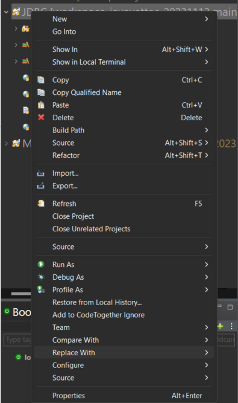
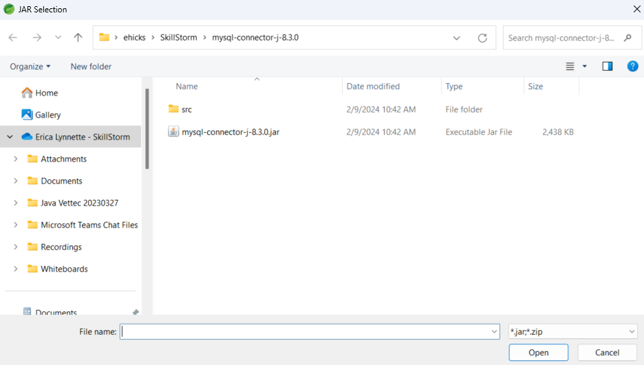

# Working with JDBC

JDBC Stands for Java Database Connectivity. It is included in the JDK. The JDK only contains the interfaces that define how to interact with a database. To use a concrete implementation of the JDBC Api you must download a driver from the database vendor. 

If you are not using a dependency management tool such as Maven or Gradle, you can download the jar file for the driver and add it to your Java project's classpath by following the below steps:

## Download Instructions
1. You can get the MySQL Connector/J Driver at [https://dev.mysql.com/downloads/connector/j/](https://dev.mysql.com/downloads/connector/j/).

2. Select the Plateform Independent version and dowload the zip file.

3. Go to your Downloads folder and extract the contents of the zip file.

4.Once you have extracted the contents, you should see a new folder that contains a jar file.

5. You should move the entire folder containing the jar out of the downloads folder to somewhere you will be able to find it.

## Updating the Classpath Instructions
Next, we will add the jar file to the class path for our Java project.

### Eclipse
1. If you are using Eclipse or Spring Tool Suite, you should be able to right click on the project and select Properties.

2. In the lefthand menu of the Properties window, select `Java Classpath`. And then open the third tab called `Libraries`.

3. Select `Add External JARS...` and browse to the MySQL Connector/J jar.

4. Once you have added the jar, you should see it in the Libraries list and be able to hit Apply and Close. 

5. Now, you should also be able to see the driver jar in the Project Explorer Left panel under `Referenced Libraries`.

If you are an Eclipse user, you can add the MySQL driver jar file to the classpath in a similar way.

### Visual Studio Code Example

1. Open the Java Project panel in the left-hand side of the VS Code window.

2. If you hover over the `Java Projects` Panel header in the top right will be three dots for `More Actions`. When you click it, you should have the option to `Configure Classpath`.

3. At the bottom of the Configure Classpath page is a section title `Referenced Libraries` and an option to `Add`to the classpath.

4. Click Add and browse to the MySQL driver jar file.

5. You should now have the MySQL Driver on the class path. You can verify this by going under the Java project in the Left-Hand panel and expanding the .vscode folder. It should contain a .settings file that now says:

## Further Resources

You are now ready to start coding. To find out how to get started coding, see the project contents here or visit the [Oracle Documentation Tutorial](https://docs.oracle.com/javase/tutorial/jdbc/basics/connecting.html).