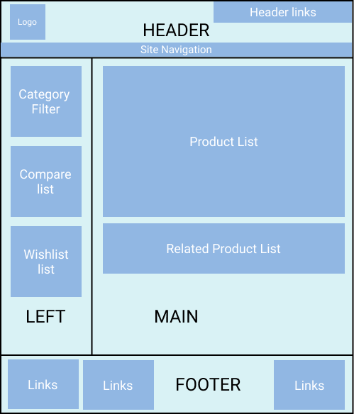
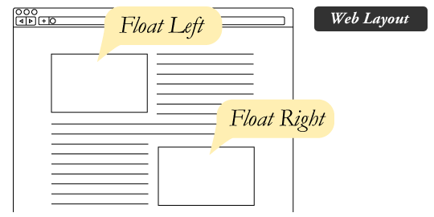
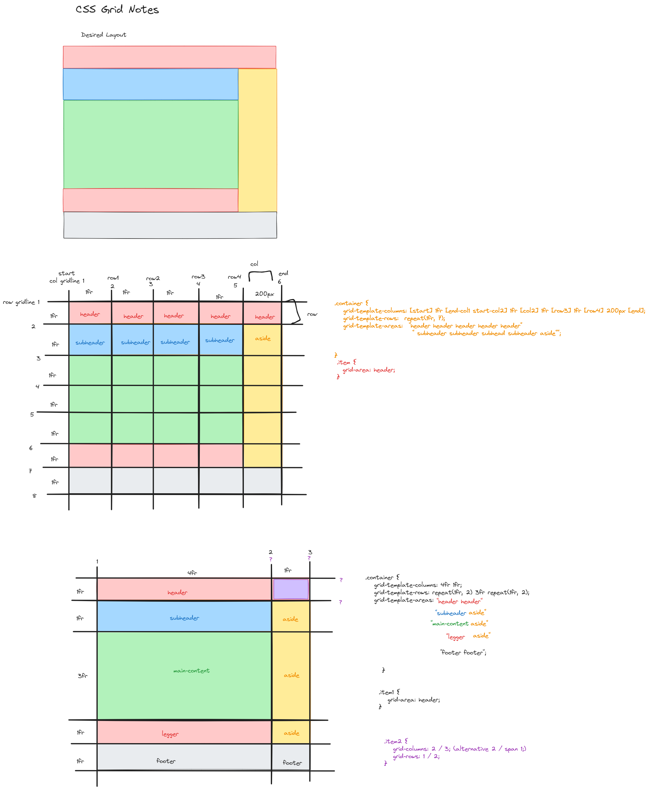

# Week 15, Day 3 Notes

Today we are talking about **Responsive Web Design**. 

Resources:
- [MDN Responsive Design](https://developer.mozilla.org/en-US/docs/Learn/CSS/CSS_layout/Responsive_Design)
- [CSS Tricks Floats](https://css-tricks.com/all-about-floats/)
- [CSS Tricks Flexbox Guide](https://css-tricks.com/snippets/css/a-guide-to-flexbox/#aa-flexbox-properties)
- [CSS Tricks Grid Guide](https://css-tricks.com/snippets/css/complete-guide-grid/#aa-display)

## Legacy Methods for Creating Layouts

To create a layout such as below, people used to use tables, rows, and cells. Then came floats, positioning and inline-block. These layout hacks left out important functionality like vertical centering. Nowadays, we have **Flex-box** and **CSS Grid**.



### Float Positioning

Floated elements remain a part of the flow of the web page. Compared to absolute positioned elements that are removed from the flow of the document.



```css
aside {
    float: right;
}
```

If you want an item next to the float to move below the float, use the `clear` property.

```css
footer {
    clear: both;
}
```

## CSS Grid Notes

CSS Grid allows us to define a grid system to place items in on the page. The grid must be defined using a template, and then items must be placed into areas or placed relative to gridlines.

Example 1: 

```css
.container {
   display: grid;
   grid-template-columns: 1fr 1fr 200px;
   grid-template-rows: repeat(3, 1fr) 5fr 1fr;
   grid-template-areas: "h1 h1 s1" 
                        "h2 h2 s2"
                        "h3 h3 s2"
                        "m  m  s2"
                        "f  f  f ";
}
.header {
   grid-area: h1 h2 h3;
}
.item1 {
  grid-column: 1 / span 3;
  grid-row: 1 / 2;
}
```
Example 2: Another example is illustrated below.

