# Node JS Installation

To practice with JavaScript outside the browser, we will start to use a NodeJS to run our code in the IDE terminal instead of in a web browser. 

> [!NOTE]
> Node.js is an open-source and cross-platform JavaScript runtime environment. 

Node.js runs the V8 JavaScript engine, the core of Google Chrome, outside of the browser. So similar to Java which needs the Java Runtime Environment (JRE) to run, JavaScript needs a runtime environment. 

Traditionally, JavaScript was only run inside of web browsers, but these days it is also used for web servers were it runs inside of the NodeJS runtime environment.

## Download Instructions

To download NodeJS go to the download page [here](https://nodejs.org/en/download). You can use the Windows installer. Make sure to select the LTS (Long Term Support) version.

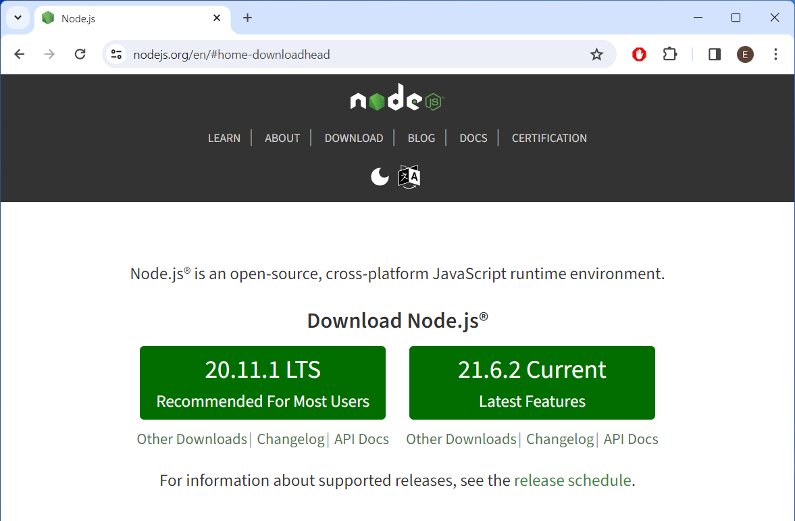
[NodeJS Widows Installer](https://nodejs.org/en/#home-downloadhead)

### Mac Installation

Or if you are on Mac and have homebrew, simply use the command:

```bash
brew install node
```

If you do not have homebrew, choose the appropriate installer from the NodeJS downloads page [here](https://nodejs.org/en/download):

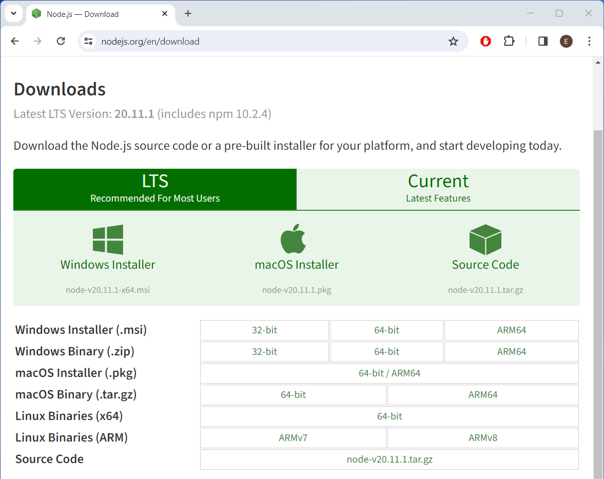

### Windows Installer

For the Windows installer, just use the defaults of the walkthrough wizard until you get to the *Chocolately* package manager option, go ahead and select it to avoid extra manual steps.

1. Open your downloads and click on the .msi file to open the installation. wizard.

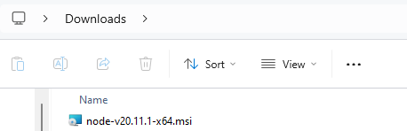

2. Select Next.

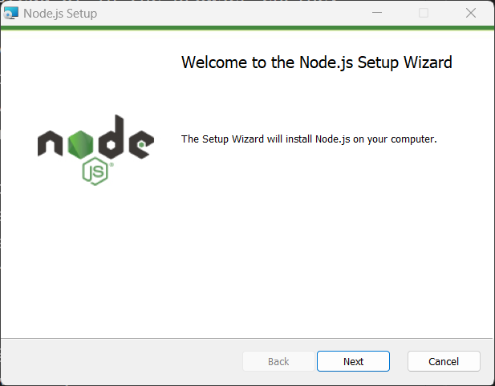

3. Accept the License Agreement and select Next.

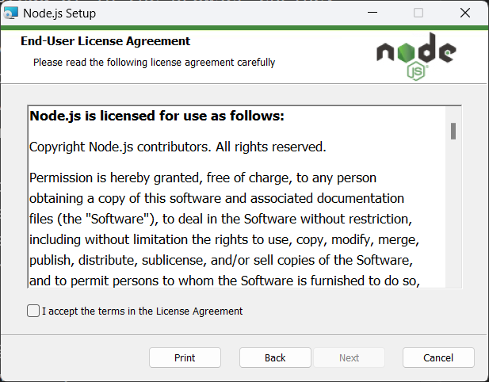

4. Keep the default install location and select Next.

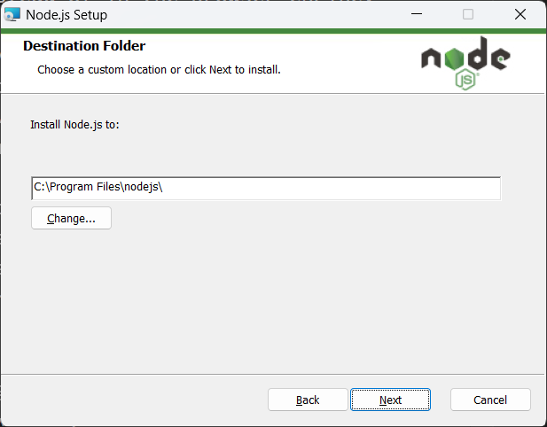

5. Keep the default features to  be installed. Notice, that NodeJS will install npm package manager as well. Select Next. 

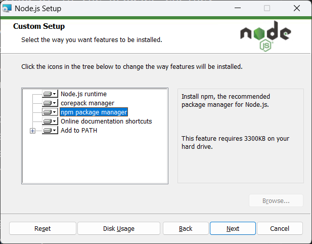

6. Select the option to install Chocolatey package manager for Window. Otherwise, you will have to follow the instructions at the given link to install other dependencies needed for NodeJS (namely the current version of Python and the C++ build environment as described [here](https://github.com/nodejs/node-gyp#on-windows).) 

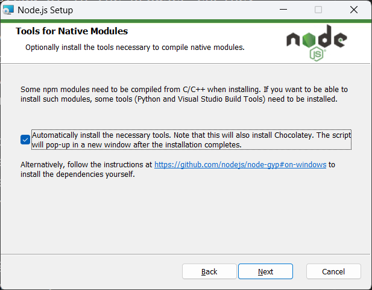

7. The installation process might take a coule minutes. When it is complete, select Next.

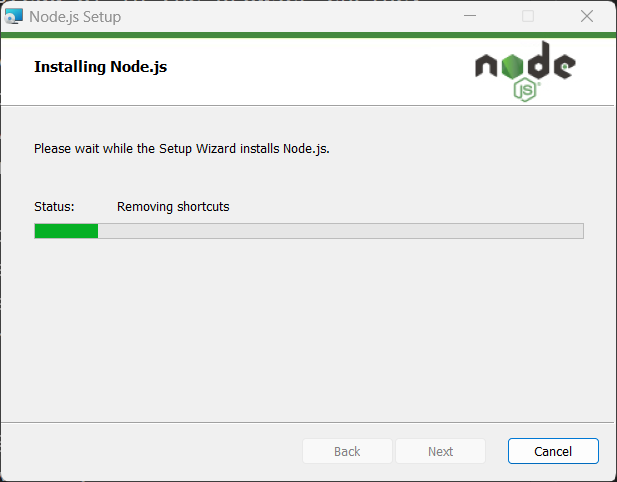

8. Select finish. This may trigger another window to open in order to install Chocolatey and the other dependencies NodeJS needs to run.

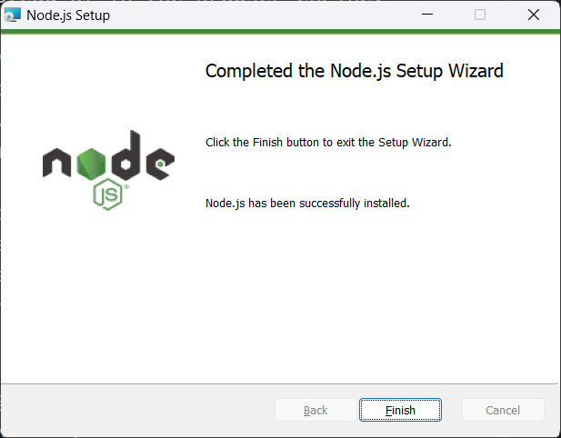

8. After selecting finish, if you opted to install Chocolately on Windows to install the other necessary dependencies, you should see another terminal window open. Press any key to get it started. It will chug away and you may see messages slightly different than the ones below depending on what you do or do not already have installed.

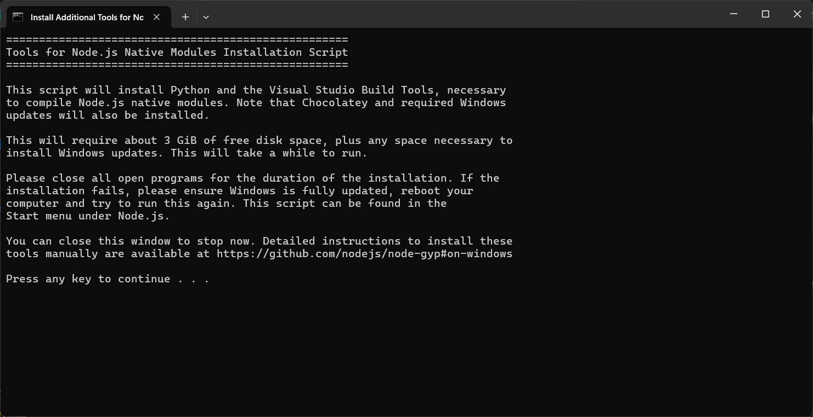

9. To continue press any key.

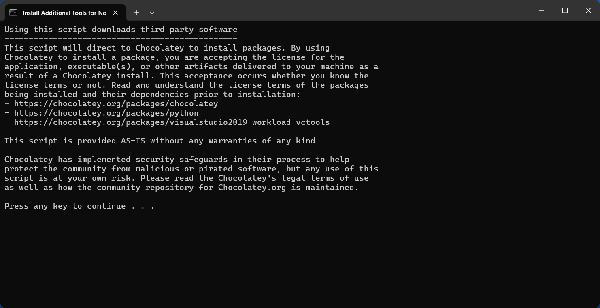

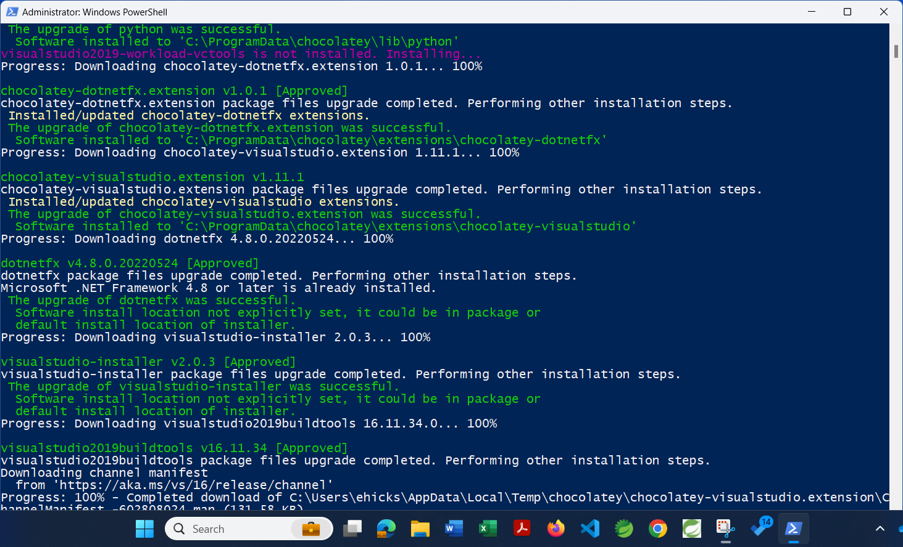

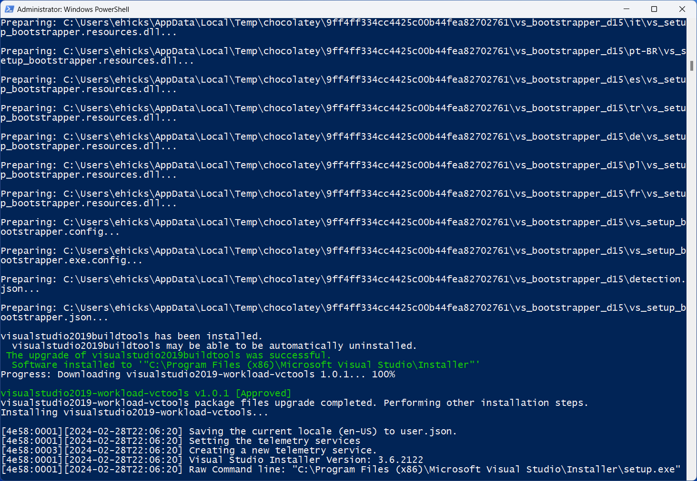

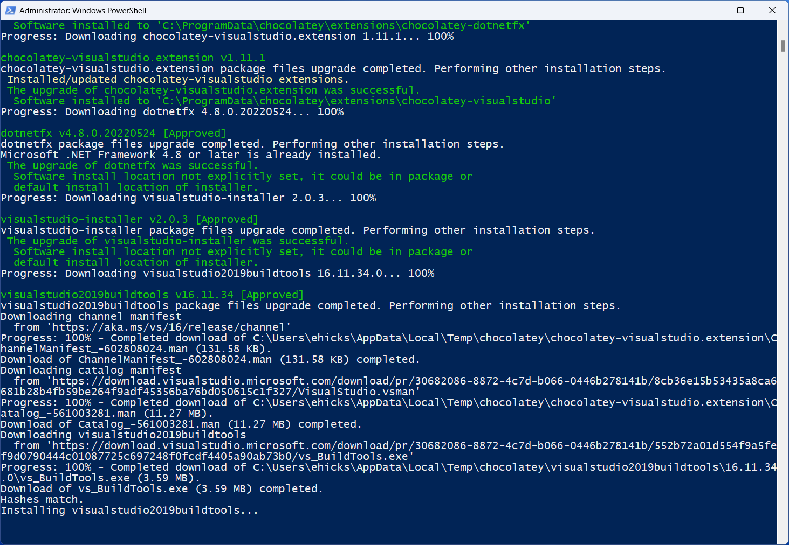

10. Leave the terminal window up for a several minutes to make sure it is done. Then go ahead and close it.

11. In a new terminal we can check if the installation was successful.

    To test that the installation of NodeJS and NPM has been successful, open a terminal and check the `npm` and `node` commands work by printing the version.

```bash
npm -v
node --version
```
    
You should see something similar to below.

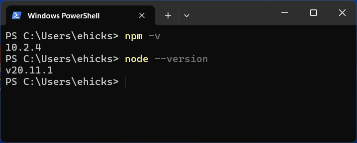

That's it! You are now ready to develop JavaScript code.
